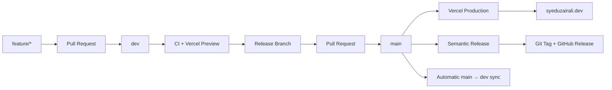

<div align="center">


# Syed Uzair Ali — Portfolio

### Software Engineer | MERN Stack Developer

Personal portfolio built with Next.js, TypeScript, and Tailwind CSS, with a production-ready development and release workflow.

[](https://syeduzairali.dev)
[](https://github.com/SyedUzairAlii/syeduzairali.dev/actions)
[](https://github.com/SyedUzairAlii/syeduzairali.dev/releases)

</div>

---

## About This Project

This repository contains the source code for my personal software engineering portfolio.

The project is being built not only as a portfolio website, but also as a place to implement and practice production engineering workflows including:

- Feature-based development
- Protected Git branches
- Pull request workflows
- Automated CI validation
- Semantic versioning
- Automated GitHub releases
- Preview deployments
- Production deployments
- Post-release branch synchronization

Live website:

### [syeduzairali.dev](https://syeduzairali.dev)

---

## Tech Stack

### Frontend

- Next.js
- React
- TypeScript
- Tailwind CSS

### Development & Tooling

- Node.js 24
- npm
- ESLint
- Git
- GitHub

### CI/CD & Deployment

- GitHub Actions
- Semantic Release
- Vercel
- Cloudflare DNS

---

## Project Structure

```text
syeduzairali.dev/
├── app/
│   ├── globals.css
│   ├── icon.png
│   ├── layout.tsx
│   └── page.tsx
│
├── components/
│   └── IntroSection.tsx
│
├── scripts/
│   └── create-release.mjs
│
├── .github/
│   └── workflows/
│       ├── ci.yml
│       └── sync-main-to-dev.yml
│
├── .nvmrc
├── release.config.mjs
├── package.json
├── package-lock.json
└── README.md
```

The structure will continue to evolve as additional portfolio sections and features are added.

---

## Development Workflow

Development happens through feature branches rather than directly on `dev` or `main`.



### Branches

| Branch       | Purpose                                  |
| ------------ | ---------------------------------------- |
| `feature/*`  | Individual feature development           |
| `chore/*`    | Tooling, infrastructure, and maintenance |
| `dev`        | Integration and development branch       |
| `release/v*` | Production release preparation           |
| `main`       | Production branch                        |

Both `dev` and `main` are protected with GitHub rulesets.

Direct production changes are intentionally avoided.

---

## Continuous Integration

GitHub Actions automatically validates pull requests.

The CI pipeline runs:

```bash
npm ci
npm run lint
npm run build
```

A pull request cannot be merged into a protected branch unless the required checks pass.

---

## Preview Deployments

Vercel automatically creates preview deployments for development and feature branches.

This allows changes to be tested in a production-like environment before they reach the live website.

```text
feature branch
      ↓
Pull Request
      ↓
GitHub Actions
      ↓
Vercel Preview
      ↓
Review & Test
```

Production deployments are created only from:

```text
main
```

and are served through:

```text
https://syeduzairali.dev
```

---

## Release Workflow

Production releases use Semantic Versioning.

When the latest `dev` branch is ready for production:

```bash
git checkout dev
git pull origin dev
npm run create-release
```

The release script:

1. Verifies the current branch
2. Ensures the working tree is clean
3. Pulls the latest `dev`
4. Determines the next semantic version
5. Creates a release branch
6. Updates the package version
7. Pushes the release branch
8. Generates a GitHub PR link

Example:

```text
dev
 ↓
npm run create-release
 ↓
release/v1.1.0
 ↓
Pull Request
 ↓
main
```

After the release PR is merged:

```text
main
 ├── Vercel Production Deployment
 ├── Semantic Release
 │    ├── Git Tag
 │    └── GitHub Release
 │
 └── Automatic sync back to dev
```

---

## Semantic Versioning

Commit messages follow Conventional Commit conventions.

### Feature

```text
feat: add projects section
```

Produces a minor release:

```text
v1.0.0 → v1.1.0
```

### Bug Fix

```text
fix: correct mobile navigation
```

Produces a patch release:

```text
v1.1.0 → v1.1.1
```

### Breaking Change

```text
feat!: redesign portfolio architecture
```

Produces a major release:

```text
v1.1.1 → v2.0.0
```

---

## Local Development

### Requirements

- Node.js 24
- npm
- Git

The repository contains an `.nvmrc` file, so if you use NVM:

```bash
nvm use
```

If Node 24 is not installed:

```bash
nvm install
```

### Install Dependencies

```bash
npm ci
```

### Start Development Server

```bash
npm run dev
```

Open:

```text
http://localhost:3000
```

---

## Available Scripts

| Command                  | Description                        |
| ------------------------ | ---------------------------------- |
| `npm run dev`            | Start the local development server |
| `npm run build`          | Create a production build          |
| `npm run start`          | Run the production build           |
| `npm run lint`           | Run ESLint                         |
| `npm run create-release` | Prepare a new production release   |
| `npm run release`        | Run Semantic Release               |

---

## Portfolio Roadmap

The portfolio is being developed incrementally.

Planned sections include:

- [x] Intro / Hero
- [x] Navigation
- [x] About
- [x] Skills
- [ ] Professional Experience
- [ ] Projects
- [ ] Certifications
- [ ] Education
- [ ] Contact
- [ ] Resume
- [ ] Responsive and accessibility improvements
- [ ] Performance and SEO optimization

---

## Deployment Architecture

```text
GitHub
   │
   │ push / merge
   ▼
GitHub Actions
   │
   ├── Install dependencies
   ├── Lint
   └── Production build
   │
   ▼
Vercel
   │
   ▼
Cloudflare DNS
   │
   ▼
syeduzairali.dev
```

---

## Security & Repository Protection

The repository uses:

- Protected `main` branch
- Protected `dev` branch
- Required pull requests
- Required CI status checks
- Force-push protection
- Branch deletion protection
- GitHub Actions secrets
- Automated release branches
- Automatic cleanup of merged branches

Sensitive environment variables and tokens are never committed to the repository.

---

## Author

### Syed Uzair Ali

Software Engineer focused on building production web and mobile applications with React, TypeScript, Next.js, Node.js, React Native, and the MERN stack.

[Portfolio](https://syeduzairali.dev) · [GitHub](https://github.com/SyedUzairAlii) · [LinkedIn](https://www.linkedin.com/in/syed-uzair-ali-a85764104/)

---

<div align="center">

Built with Next.js, TypeScript, Tailwind CSS and a lot of ☕.

**[Visit syeduzairali.dev →](https://syeduzairali.dev)**

</div>
